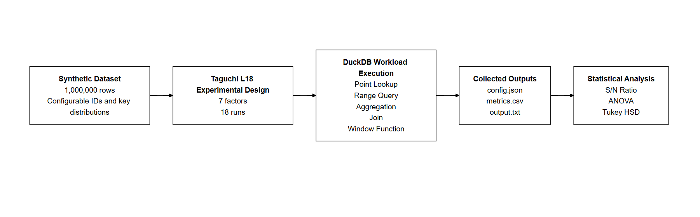
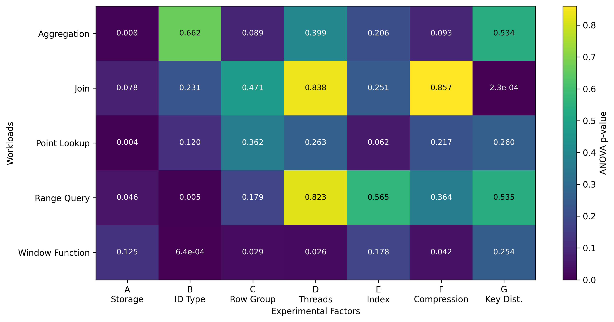
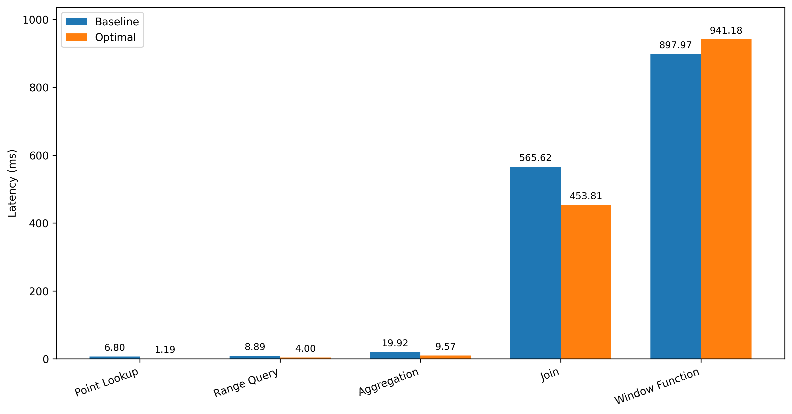
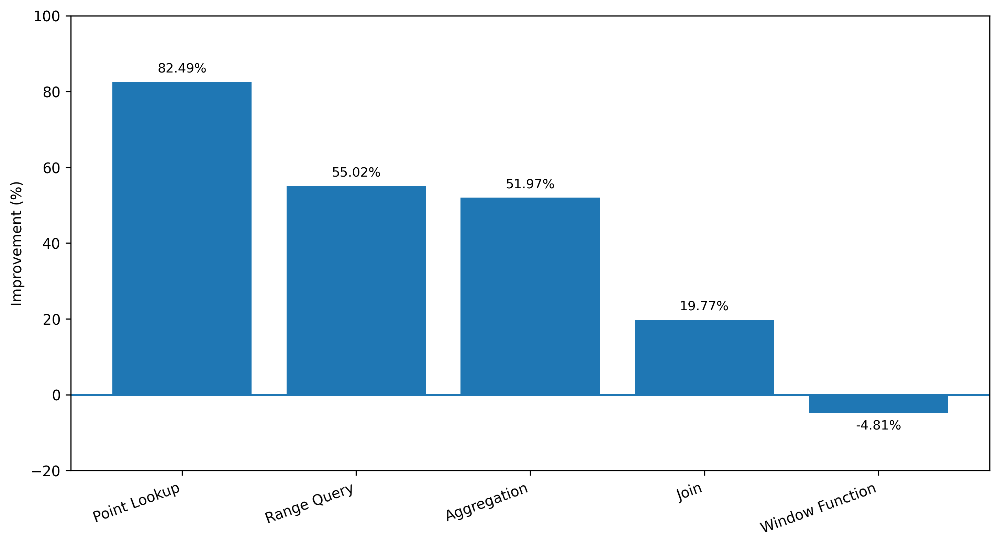

<div align="center">
<h1 align="center">duckdb-parametric-eval</h1>

<p align="center">
  <b>Experimental Evaluation of DuckDB Performance under Parametric Optimization Scenarios</b>
</p>

<p align="center">
  
  
  
  
  
</p>

<p align="center">
  <a href="2026_DuckDBEvaluation_Article.pdf">Paper</a> &nbsp;|&nbsp;
  <a href="#overview">Overview</a> &nbsp;|&nbsp;
  <a href="#quick-start">Quick Start</a> &nbsp;|&nbsp;
  <a href="#methodology">Methodology</a> &nbsp;|&nbsp;
  <a href="#experimental-runs">Experimental Runs</a>
</p>

<p align="center">
  <a href="#results-summary">Results Summary</a> &nbsp;|&nbsp;
  <a href="#repository-structure">Repository Structure</a> &nbsp;|&nbsp;
  <a href="#reproducibility">Reproducibility</a> &nbsp;|&nbsp;
  <a href="#citation">Citation</a>
</p>

<p align="center">
  
</p>

<p align="center"><em>
Experimental workflow of the DuckDB benchmark, from Taguchi L18 design and deterministic dataset generation to workload execution, metric collection, and statistical analysis.
</em></p>

</div>

---

## Overview

This repository accompanies the paper **"Experimental Evaluation of DuckDB Performance under Parametric Optimization Scenarios"** and contains the benchmark implementation, experiment outputs, figures, and reproducibility materials used in the study.

The goal of this work is to evaluate how DuckDB configuration parameters affect analytical query performance under controlled conditions. The study adopts a **Taguchi L18 fractional factorial array** to explore to explore seven configuration factors while keeping the number of experimental runs manageable.

The benchmark focuses on the following factors:

1. **Storage Mode**: Parquet vs. Materialized  
2. **ID Type**: Sequential Integer, UUIDv4, UUIDv7  
3. **Row-Group Size**: 32K, 128K, 512K  
4. **Threads**: 1, 4, 8  
5. **Index Strategy**: No Index, Index On Load, Index On Demand  
6. **Compression**: Snappy, ZSTD, None  
7. **Key Distribution**: Uniform, Zipf, Empirical  

The evaluation covers five representative SQL workloads:

- **Point Lookup**
- **Range Query**
- **Aggregation**
- **Join**
- **Window Function**

Performance is assessed through **latency**, **CPU time**, **memory consumption**, and **row-group pruning efficiency**, followed by **signal-to-noise analysis**, **ANOVA**, and **Tukey HSD** post-hoc testing.

This repository is intended for **academic evaluation, transparency, and reproducibility**, allowing reviewers to inspect the benchmark workflow, per-run configurations, generated metrics, figures, and statistical outputs.

---

## Quick Start

### 1. Clone the repository

```bash
git clone https://github.com/Fcruz10/duckdb-parametric-eval.git
cd duckdb-parametric-eval
```

### 2. Install dependencies

```bash
pip install duckdb pandas pyarrow numpy scipy statsmodels jupyter
```

### 3. Open the notebook

```bash
jupyter notebook
```

Then open:

```text
duckdb_parametric_evaluation.ipynb
```

### 4. Inspect benchmark outputs

The benchmark results are organized per run under:

```text
benchmark_results/content/results/run_XX/
```

Each run stores at least:

* `config.json`
* `metrics.csv`

The aggregated execution and statistical analysis log is available in:

```text
output.txt
```

---

## Methodology

The study uses the **Taguchi Method** with an **L18 orthogonal array**, enabling the evaluation of several factors in a statistically structured way with only 18 runs instead of a much larger full-factorial design.

To quantify performance, the benchmark uses repeated measurements and computes **Signal-to-Noise (S/N) ratios**. For metrics where lower values are preferable, such as latency or CPU time, the **Smaller-is-Better (SIB)** formulation is applied:

$$
SN_{SIB} = -10 \log_{10} \left( \frac{1}{n} \sum_{i=1}^{n} y_i^2 \right)
$$

where:

* $y_i$ is the observed value for repetition $i$
* $n$ is the number of measured repetitions

This formulation penalizes both high average latency and unstable executions.

The statistical workflow includes:

* **ANOVA**, to determine which factors significantly affect each workload
* **effect size analysis**, to estimate practical relevance
* **Tukey HSD post-hoc testing**, to compare levels when significance is detected

<details>
<summary><b>Illustrative benchmark pseudocode</b></summary>

```python
def run_benchmark(config: dict, parquet_path: Path, queries: dict) -> pd.DataFrame:
    """
    Execute the workload queries under a given Taguchi configuration.
    """
    con = duckdb.connect(database="run.duckdb", read_only=False)
    con.sql(f"PRAGMA threads={config['Threads']}")

    # Ingestion / materialization step
    if config['Storage_Mode'] == 'Materialized':
        con.sql(f"CREATE TABLE sales AS SELECT * FROM read_parquet('{parquet_path}');")

        if config['Index_Strategy'] == 'Index_On_Load':
            con.sql("CREATE INDEX idx_sales_id ON sales(id);")

    results = []

    for query_name, query_sql in queries.items():

        # Warm-up executions
        for _ in range(3):
            con.sql(query_sql).fetchall()

        # Measured executions
        for rep in range(8):
            t_start = time.perf_counter()
            con.sql(query_sql).fetchall()
            t_end = time.perf_counter()

            results.append({
                "query_name": query_name,
                "latency_ms": (t_end - t_start) * 1000
            })

    return pd.DataFrame(results)
```

</details>

---

## Repository Structure

A recommended repository layout is:

```text
.
├── README.md
├── 2026_DuckDBEvaluation_Article.pdf
├── duckdb_parametric_evaluation.ipynb
├── output.txt
├── benchmark_results/
│   └── content/
│       └── results/
│           ├── run_01/
│           │   ├── config.json
│           │   └── metrics.csv
│           ├── run_02/
│           │   ├── config.json
│           │   └── metrics.csv
│           ├── ...
│           └── run_18/
│               ├── config.json
│               └── metrics.csv
└── assets/
    ├── overview.png
    ├── anova_pvalues_heatmap.png
    ├── baseline_vs_optimal_latency_linear.png
    └── improvement_percentage_by_workload.png
```

### Main files

* **`duckdb_parametric_evaluation.ipynb`**
  Jupyter notebook containing the benchmark workflow, including dataset generation, benchmark execution, metrics collection, and analysis.

* **`benchmark_results/content/results/run_XX/`**
  Per-run outputs generated by the benchmark.

* **`output.txt`**
  Full execution log, including the 18 experimental runs and the final statistical analysis.

* **`2026_DuckDBEvaluation_Article.pdf`**
  Paper associated with this repository.

---

## Experimental Runs

The benchmark is executed across **18 runs**, as defined by the Taguchi L18 design.

The execution log confirms the progression through **Run 1** to **Run 18**, with each configuration evaluating the same five workload categories. The repository also includes per-run outputs such as `config.json` and `metrics.csv`.

For example, **Run 1** uses the following baseline configuration:

* Storage Mode: **Parquet**
* ID Type: **Sequential_INTEGER**
* Row Group Size: **32000**
* Threads: **1**
* Index Strategy: **No_Index**
* Compression: **Snappy**
* Key Distribution: **Uniform**

This configuration is used in the paper as the baseline for the confirmation experiments.

---

## Results Summary

The results show that DuckDB performance is **workload-dependent** and that there is **no single globally optimal configuration** across all query profiles.

<p align="center">
  
</p>
<p align="center"><em>
Heatmap of ANOVA p-values across workloads and experimental factors.
</em></p>

The main findings reported in the paper are:

- **Aggregation** is primarily affected by **Storage Mode**, with **Materialized** storage outperforming direct Parquet scanning.
- **Join** is primarily affected by **Key Distribution**, with **Uniform** distributions outperforming both Zipf and Empirical distributions.
- **Point Lookup** is primarily affected by **Storage Mode**, with materialized storage substantially reducing latency.
- **Range Query** shows statistically significant effects for **Storage Mode** and **ID Type**, with clearer pairwise separation for **ID Type** in the post-hoc analysis.
- **Window Function** is the most configuration-sensitive workload in the ANOVA, with significant effects for **ID Type**, **Row-Group Size**, **Threads**, and **Compression**; however, pairwise Tukey separation is strongest for **ID Type**.


The confirmation experiments compare the shared baseline configuration against workload-specific optimal configurations:

| Workload        | Baseline (ms) | Optimal (ms) | Improvement |
| :-------------- | ------------: | -----------: | ----------: |
| Point Lookup    |          6.80 |         1.19 |     +82.49% |
| Range Query     |          8.89 |         4.00 |     +55.02% |
| Aggregation     |         19.92 |         9.57 |     +51.97% |
| Join            |        565.62 |       453.81 |     +19.77% |
| Window Function |        897.97 |       941.18 |      -4.81% |


<p align="center">
  
</p>

<p align="center"><em>
Baseline versus workload-specific optimal latency in the confirmation experiments.
</em></p>

<p align="center">
  
</p>

<p align="center"><em>
Relative latency improvement of the workload-specific optimal configuration over the shared baseline.
</em></p>


These results indicate that targeted configuration tuning can produce substantial gains for retrieval and aggregation workloads, while more complex analytical patterns may involve effects that are not fully captured by the reduced L18 screening design.

---

## Reproducibility

This repository is structured so that evaluators can verify the study at three levels:

### 1. Paper-level inspection

Read:

* `2026_DuckDBEvaluation_Article.pdf`

### 2. Implementation-level inspection

Open:

* `duckdb_parametric_evaluation.ipynb`

### 3. Output-level inspection

Inspect:

* `benchmark_results/content/results/run_01/`
* `benchmark_results/content/results/run_02/`
* ...
* `benchmark_results/content/results/run_18/`
* `output.txt`

A practical evaluation order is:

1. `README.md`
2. `2026_DuckDBEvaluation_Article.pdf`
3. `duckdb_parametric_evaluation.ipynb`
4. `benchmark_results/content/results/run_01/`
5. `output.txt`

This gives a reviewer direct access to the study rationale, experiment implementation, example run configuration, generated outputs, and statistical evidence.

---

## Notes for Evaluators

This repository was prepared to support **transparent academic review**.

In particular, it allows evaluators to:

* Inspect the benchmark design,
* Verify the configuration factors and levels,
* Review per-run outputs,
* Examine the final statistical analysis,
* Compare the repository contents with the conclusions reported in the paper.

---

## Citation

If you use this repository or refer to this work, please cite:

```bibtex
@article{cruz2026duckdbeval,
  title       = {Experimental Evaluation of DuckDB Performance under Parametric Optimization Scenarios},
  author      = {Cruz, Francisco and Silva, Diogo and Borges, Rui and Matos, Paulo and Oliveira, Pedro},
  year        = {2026},
  institution = {Instituto Politécnico de Bragança},
  note        = {Code, benchmark outputs and reproducibility materials available on GitHub}
}
```

---

## License

This repository is licensed under the **MIT License**. See the `LICENSE` file for details.
